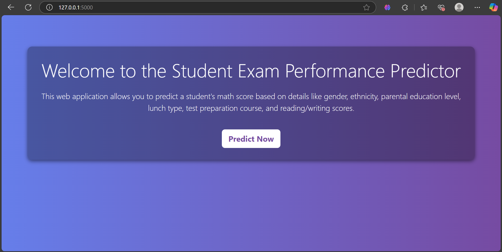
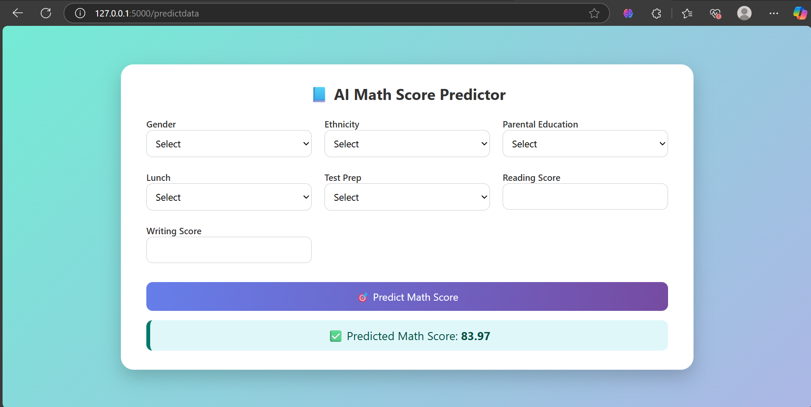

# ML Project: End-to-End Deployment
## Screenshots

### Home Page


### Prediction Page

This repository contains an end-to-end machine learning project, from data preprocessing to model deployment. The project demonstrates the complete lifecycle of a machine learning application.

## Repository Link
[GitHub Repository](https://github.com/IbrahimBagwan1/ml_project.git)

---

## Table of Contents
1. [Project Overview](#project-overview)
2. [Features](#features)
3. [Technologies Used](#technologies-used)
4. [Setup Instructions](#setup-instructions)
5. [Project Workflow](#project-workflow)
6. [Deployment](#deployment)
7. [Contributing](#contributing)
8. [License](#license)

---

## Project Overview
This project involves building a machine learning model to solve a specific problem. The workflow includes:
- Data collection and preprocessing
- Exploratory data analysis (EDA)
- Model training and evaluation
- Hyperparameter tuning
- Deployment of the model as a web application

---

## Features
- Data preprocessing pipeline
- Model training and evaluation
- Interactive web application for predictions
- Scalable deployment using cloud services

---

## Technologies Used
- **Programming Language**: Python
- **Libraries**: NumPy, Pandas, Scikit-learn, Matplotlib, Seaborn, TensorFlow/PyTorch
- **Web Framework**: Flask/Django/FastAPI
- **Deployment**: Docker, AWS/GCP/Azure, Heroku

---

## Setup Instructions
1. Clone the repository:
  ```bash
  git clone https://github.com/IbrahimBagwan1/ml_project.git
  cd ml_project
  ```

2. Create a virtual environment:
  ```bash
  python -m venv venv
  source venv/bin/activate  # On Windows: venv\Scripts\activate
  ```

3. Install dependencies:
  ```bash
  pip install -r requirements.txt
  ```

4. Run the application:
  ```bash
  python app.py
  ```

---

## Project Workflow
1. **Data Collection**: Gather data from reliable sources.
2. **Data Preprocessing**:
  - Handle missing values
  - Encode categorical variables
  - Normalize/scale numerical features
3. **Exploratory Data Analysis (EDA)**:
  - Visualize data distributions
  - Identify correlations
4. **Model Training**:
  - Train multiple models
  - Evaluate performance using metrics like accuracy, precision, recall, etc.
5. **Hyperparameter Tuning**:
  - Optimize model parameters using GridSearchCV/RandomizedSearchCV
6. **Model Deployment**:
  - Build a REST API using Flask/Django/FastAPI
  - Containerize the application using Docker
  - Deploy to cloud platforms like AWS, GCP, or Heroku

---

## Deployment
The model is deployed as a web application. Follow these steps for deployment:
1. Build a Docker image:
  ```bash
  docker build -t ml_project .
  ```
2. Run the Docker container:
  ```bash
  docker run -p 5000:5000 ml_project
  ```
3. Deploy to a cloud platform (e.g., AWS, GCP, Heroku).

---

## Contributing
Contributions are welcome! Please follow these steps:
1. Fork the repository.
2. Create a new branch:
  ```bash
  git checkout -b feature-name
  ```
3. Commit your changes:
  ```bash
  git commit -m "Add feature-name"
  ```
4. Push to the branch:
  ```bash
  git push origin feature-name
  ```
5. Open a pull request.

---

## License
This project is licensed under the MIT License. See the [LICENSE](LICENSE) file for details.
